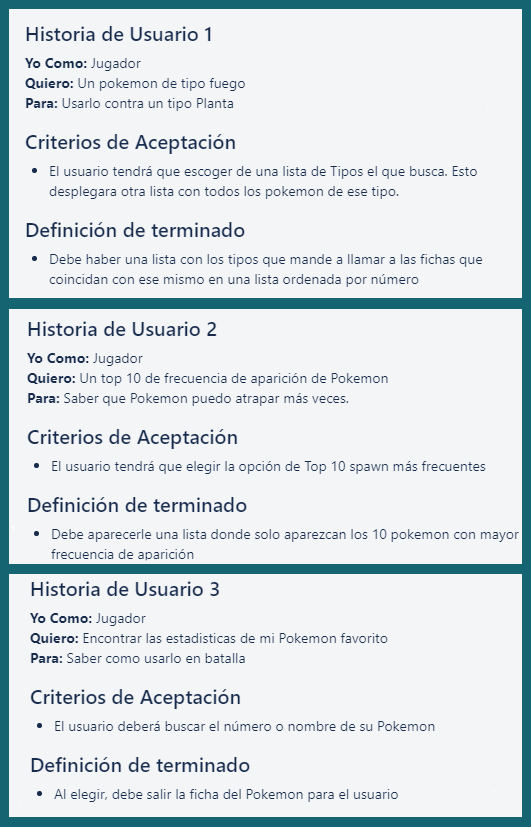
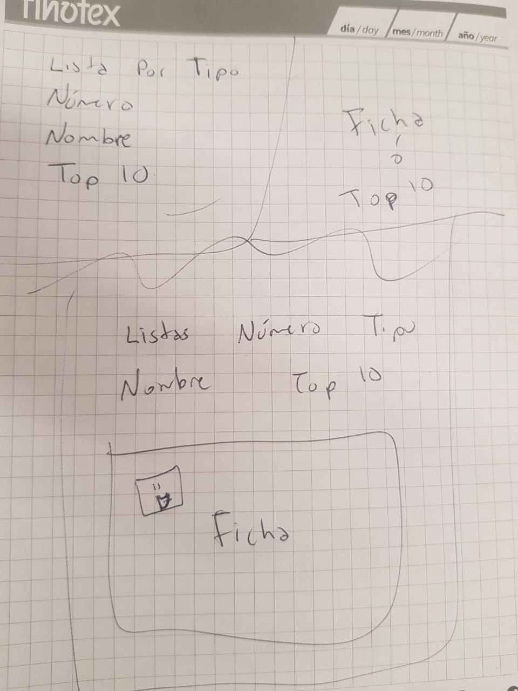
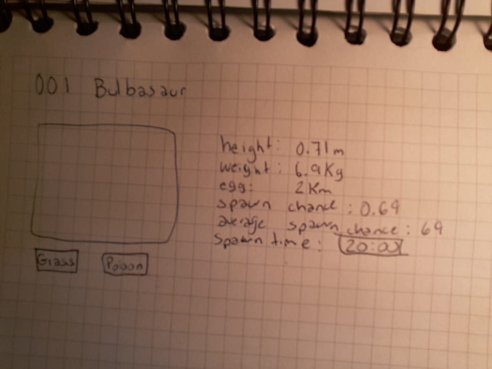
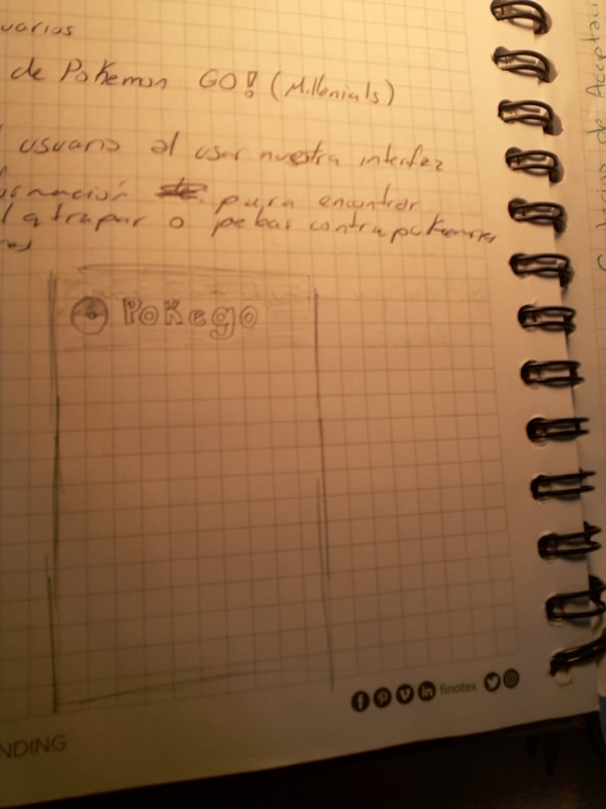
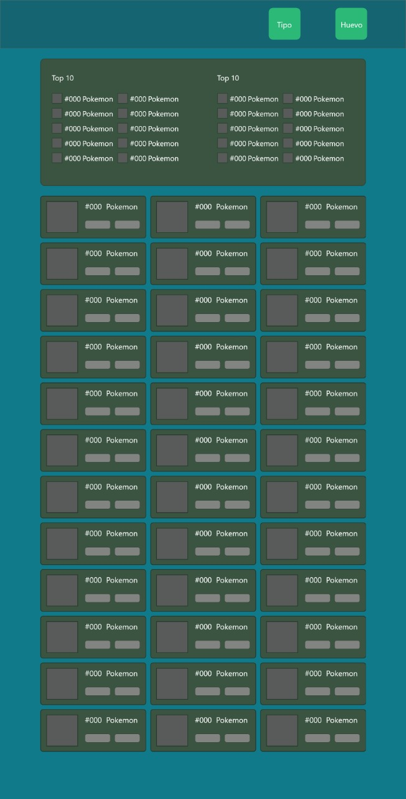
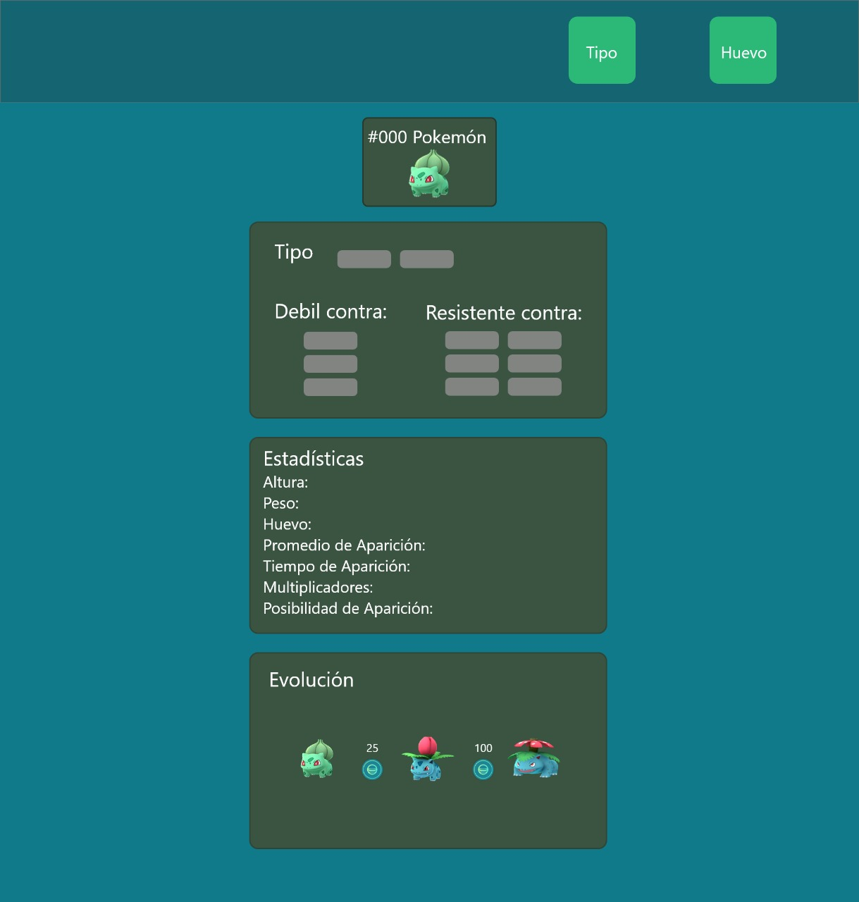
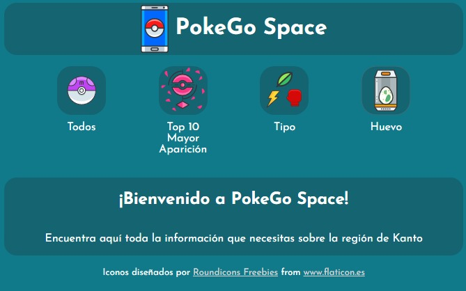
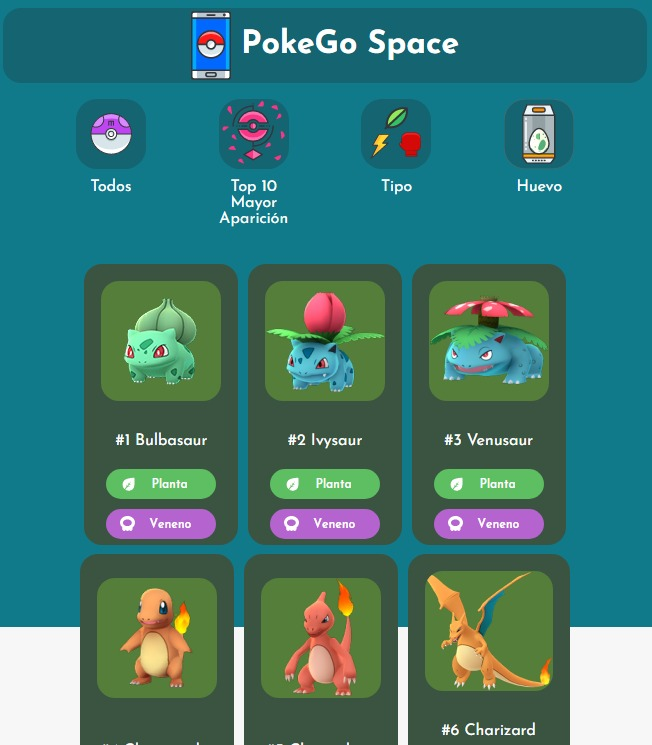
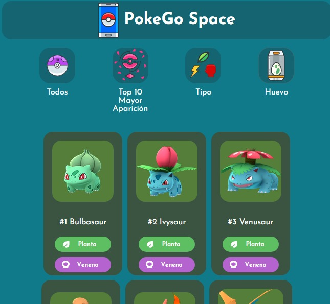
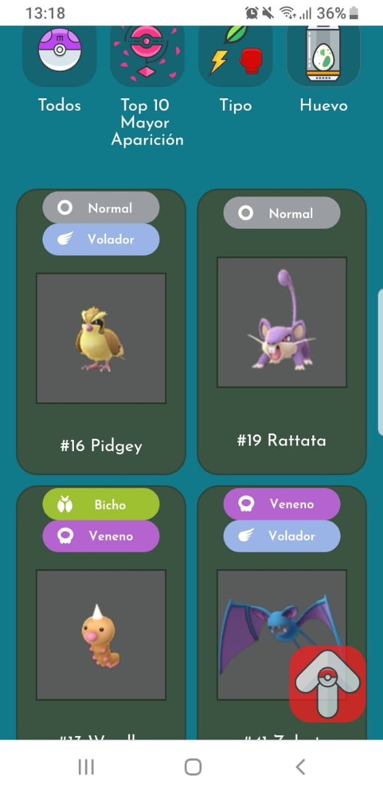

# ⚡️PokeGo Space - Data lovers ⚡️

## Descripción:
Hacer una interfaz de caracter informativo donde el usuario pudiera interactuar, filtrar. Con diseño responsive para visualizarlo en múltiples dispositivos. 📱 💻

## Desarrollo:
Para el desarrollo del proyecto nos dimos a la 📓 tarea de investigar, una vez elegido el tema que en este caso fue la lista de 151 Pokémon de la región de Kanto, junto con sus respectivas 📊estadísticas usadas en el juego Pokémon GO, llegamos a la conclusión de que lo juegan personas de casi todas las edades, desde niños 👦 hasta adultos 🙎 👩 de 36 años y es así como llegamos a las "historias de usuario" para saber las necesidades de los interesados en el juego.

## 🤓 Historias de usuario.
A continuación, mostraremos 3 historias de usuario que implementamos para el desarrolo de la interfaz. ⤵️

 

## 📝Prototipo de baja fidelidad.

Aquí se hicieron algunas ideas del diseño de interfaz para filtrado y para mostrar ficha técnica. 

## 💻 🖱Prototipo de alta fidelidad.

Se hicieron muchas modificaciones adecuando botones de filtro para un mejor manejo para el usuario.

Diseño que muestra los 151 Pokémones. ⤵️

Diseño de ficha técnica ⤵️

Se fueron implementando más cambios en el diseño conforme al desarrollo y así es como llegamos al resultado final que se muestra a continuación...

## 💥Resultado final 💥

Ahora mostramos el terminado con botones de filtrado, tarjetas, botón de regreso al inicio así como el diseño responsive para dispositivo móvil.

Diseño responsive en móvil 📱 ⤵️

